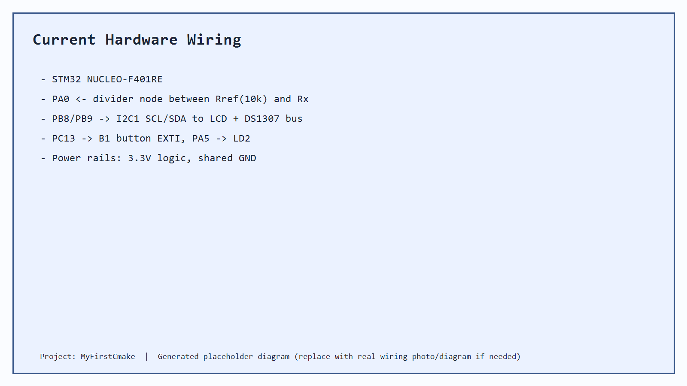
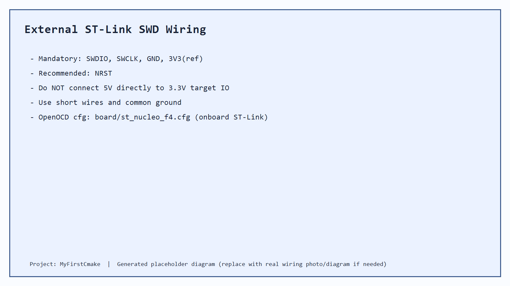
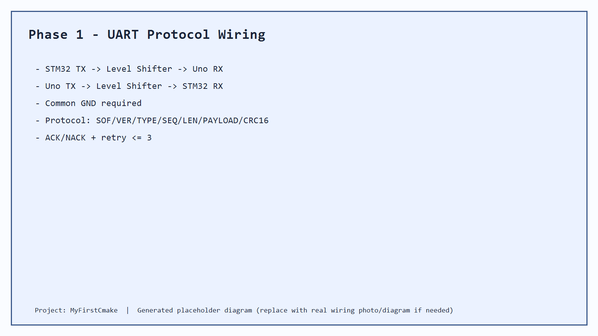
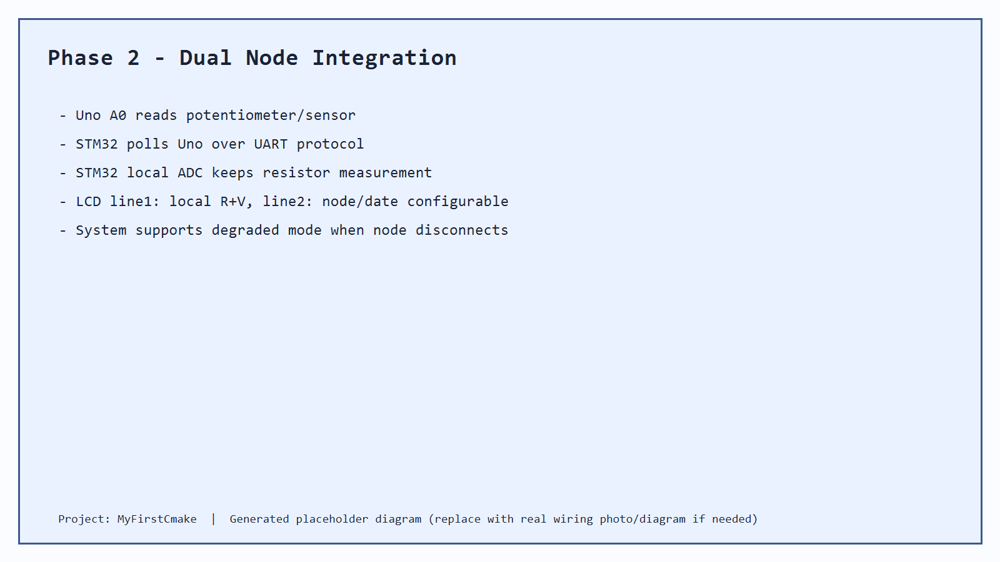
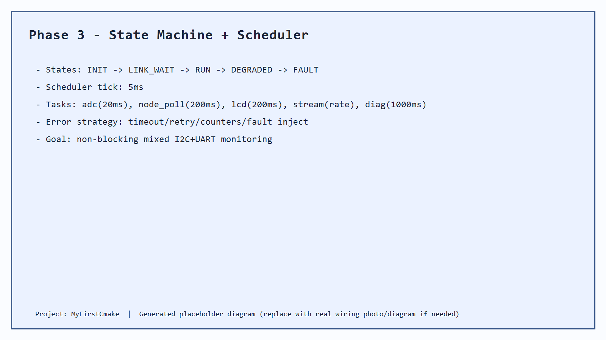

# MyFirstCmake - STM32F401 電阻量測專案

## Project Snapshot
本專案目前的穩定版本功能是：
- 以 `STM32 NUCLEO-F401RE (STM32F401RETx)` 量測未知電阻 `Rx`
- 使用 16x2 I2C LCD 顯示 `電阻 + 電壓`
- 顯示 DS1307 讀取的日期（`20YY-MM-DD`）
- 透過 B1 按鍵觸發 DS1307 歸零時間（除錯用）

目前 branch 主要為「量測電阻 + LCD 顯示電阻/日期」版本。

## Current Firmware Configuration
以下為目前程式/IOC 實際配置：

### Clock / MCU
- Board: `NUCLEO-F401RE`
- MCU: `STM32F401RETx`
- SYSCLK: `84MHz`（HSI + PLL）

### Peripheral Configuration
- ADC1
  - Pin: `PA0 (ADC1_IN0)`
  - Resolution: `12-bit`
  - Sample time: `84 cycles`
  - Mode: single conversion, software trigger
- I2C1
  - Pins: `PB8(SCL)`, `PB9(SDA)`
  - Speed: `100kHz`
  - Bus devices: I2C LCD + DS1307
- RTC
  - Source: `LSI`
- EXTI
  - Pin: `PC13 (B1)` falling edge
- GPIO
  - `PA5` (LD2) status toggle when LCD not ready

### Measurement Parameters (from main.c)
- `ADC_SAMPLES = 32`
- `ADC_MAX_COUNTS = 4095`
- `VREF_MV = 3300`
- `RREF_OHM = 10000`

### Runtime Behavior
- 更新週期：`200ms`
- LCD line1：`R + V`（例如 `R:10.0k 1.65V`）
- LCD line2：`20YY-MM-DD` 或 `RTC READ ERROR`
- B1 防彈跳：`50ms`

### USART 狀態
- 目前 `.ioc` 保留 `PA2/PA3` 為 USART2 AF pin
- **目前版本尚未啟用 USART2 外設初始化與通訊邏輯**（這是後續 roadmap 的 Phase1）

## Current Hardware Wiring

### 1) 電阻量測分壓
- `3.3V -> Rref(10k) -> (Node) -> Rx(unknown) -> GND`
- `PA0` 接在 `(Node)`

### 2) I2C 匯流排
- `PB8 -> SCL`
- `PB9 -> SDA`
- LCD 與 DS1307 併接同一條 I2C bus
- 共地（GND common）

### 3) 板上資源
- `PC13`：B1 button
- `PA5`：LD2 LED



圖說：目前量測系統接線示意（可用實拍替換同檔名圖片）。

## Toolchain & Environment Setup

### Required Tools
- GNU Arm Embedded Toolchain (`arm-none-eabi-gcc`)
- CMake (>= 3.22)
- Ninja
- OpenOCD
- (可選) VSCode + Cortex-Debug

### PATH Quick Check (PowerShell)
```powershell
arm-none-eabi-gcc --version
cmake --version
ninja --version
openocd --version
```

### Toolchain File
專案使用：`cmake/arm-none-eabi-gcc.cmake`

若看見錯誤：`arm-none-eabi-gcc not found. Add GNU Arm Toolchain to PATH.`
請先修正 PATH。

## Build（詳細）

### 1) 首次 configure
```powershell
cmake -S . -B build -G Ninja -DCMAKE_TOOLCHAIN_FILE=cmake/arm-none-eabi-gcc.cmake -DCMAKE_BUILD_TYPE=Debug
```

### 2) 編譯
```powershell
cmake --build build -j4
```

### 3) 產物
- `build/MyFirstCmake.elf`
- `build/MyFirstCmake.hex`
- `build/MyFirstCmake.bin`
- `build/MyFirstCmake.map`

### VSCode Tasks 對應
- `CMake: Configure`
- `CMake: Build`
- `CMake: Flash (OpenOCD)`

## Programmer & Flash（燒錄器詳細）

### 預設燒錄器
- Nucleo 板載 `ST-Link`（USB 連接）
- `openocd.cfg` 目前內容：
  - `source [find board/st_nucleo_f4.cfg]`

### 一鍵燒錄（含建置）
```powershell
cmake --build build --target flash
```

### 手動 OpenOCD 燒錄
```powershell
openocd -f openocd.cfg -c "program build/MyFirstCmake.elf verify reset exit"
```

### 單純啟動 OpenOCD server（除錯用）
```powershell
cmake --build build --target debug
```

## External ST-Link Wiring（外接燒錄器接線）
外接 ST-Link（非板載）時，至少接：
- `SWDIO`
- `SWCLK`
- `GND`
- `3V3(ref)`

建議再接：
- `NRST`

注意：
- 不可把 `5V` 直接接到 target 的 `3.3V IO`
- 必須共地



圖說：外接 ST-Link SWD 接線示意。

## Debug（詳細）
目前 `.vscode/launch.json` 的 Cortex-Debug 設定重點：
- `servertype: openocd`
- `configFiles: openocd.cfg`
- `adapter speed 1000`
- `runToEntryPoint: main`

### 建議流程
1. 先 `CMake: Build`
2. 接上板子（ST-Link USB）
3. 啟動 `STM32F401RE Debug (OpenOCD)`

## Troubleshooting

### 1) `arm-none-eabi-gcc not found`
- 原因：工具鏈不在 PATH
- 解法：安裝 GNU Arm Toolchain，重開 shell，確認 `arm-none-eabi-gcc --version`

### 2) `openocd: can't find board/st_nucleo_f4.cfg`
- 原因：OpenOCD 安裝不完整或腳本路徑錯誤
- 解法：重新安裝 OpenOCD，確認 `openocd -v` 可執行

### 3) `Error: unable to connect to target`
- 檢查：USB 線、驅動、板子供電、ST-Link 韌體
- 解法：重插 USB、重開 OpenOCD、降低 adapter speed

### 4) `target voltage too low`
- 原因：目標板未供電或接線錯
- 解法：確認 Nucleo 供電與 GND 共地

### 5) I2C 裝置未偵測（LCD/DS1307）
- 檢查：SCL/SDA 是否接反、共地、模組供電
- 檢查：I2C 位址（常見 LCD `0x27` / `0x3F`，RTC `0x68`）
- 解法：先看開機 I2C 掃描畫面

## Roadmap 1 -> 2 -> 3（配置與接線）

## Phase 1：UART 協議（STM32 <-> Uno）
### 配置
- USART2: `115200 8N1`
- 協議：`SOF/SEQ/LEN/PAYLOAD/CRC16`
- 控制：`ACK/NACK + retry`

### 接線
- `STM32_TX -> Level Shifter -> Uno_RX`
- `Uno_TX -> Level Shifter -> STM32_RX`
- `GND common`



圖說：Phase1 著重協議可靠性與重傳策略。

## Phase 2：Uno Sensor Node 整合
### 配置
- Uno A0 掛電位器（或其他類比感測）
- STM32 週期 poll Uno 節點
- 本地電阻量測 + 節點資料整合顯示

### 接線
- 延用 Phase1 UART 接線
- Uno A0 + Potentiometer（5V/GND/Signal）



圖說：Phase2 著重雙節點資料整合與掉線恢復。

## Phase 3：狀態機 + 非阻塞混合監控
### 配置
- 5ms tick scheduler
- 任務：`adc(20ms) / node_poll(200ms) / lcd(200ms) / stream(rate) / diag(1000ms)`
- 狀態：`INIT / LINK_WAIT / RUN / DEGRADED / FAULT`

### 接線
- 延用 Phase2
- 維持 I2C LCD + DS1307 + 本地分壓量測



圖說：Phase3 著重系統架構與故障降級行為。

## Validation Checklist
- [ ] Build 成功（產生 `.elf/.hex/.bin`）
- [ ] Flash 成功（OpenOCD verify/reset）
- [ ] LCD 正常顯示 line1（R + V）
- [ ] LCD 正常顯示 line2（日期）
- [ ] 調整 Rx 後數值隨之變化
- [ ] DS1307 日期可穩定讀取
- [ ] （未來）Phase1 協議驗證
- [ ] （未來）Phase2 掉線恢復驗證
- [ ] （未來）Phase3 壓力測試與狀態轉移驗證

## Notes
- 本 README 先提供可執行流程與示意圖；可後續用實拍接線照替換 `docs/assets/*.png`。
- 本次文件更新不涉及任何程式碼行為變更。
